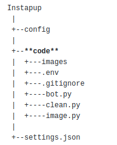
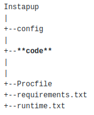

# Instapup
An Instagram bot that attempts to upload a photo of a dog every 5 minutes!

## Tools

* VSCode
* Python 3.8.5

### Python Libraries & modules

* Instabot
* Beautiful Soup
* dontenv
* requesting
* random
* threading

## Project Overview

### Files

### Local Project Structure

#### Local Structure in Depth

##### Code
 A folder that contains bot.py, clean.py, and and image.py.
 
##### boy.py
 
##### clean.py

##### image.py

 ### Heroku Deployment Structure
 

#### Heroku Structure in Depth

##### Code
 A folder that contains bot.py and a modified combination of clean.py and image.py.
 The combination was due to the limit of 2 free dynos. 
 
##### Procfile
 
##### requriments.txt
 
##### runtime.txt
 
 
## Project Images

 

 

